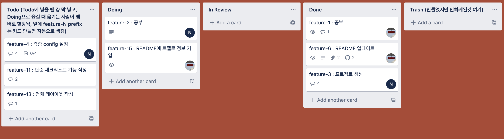

# todo list

> 체크리스트 web front end 만들기 by React / Typescript / Firebase

 

## 기간
- 총 기간 : 2021-01-28 ~ 2021-02-28
    - 사전 조사 : 2021-01-28 ~ 2021-02-03
    - 개발 : 2021-02-03 ~ 2021-02-26
    - 검수 : 2021-02-27 ~ 2021-02-28
 

## Trello
- 링크 : https://trello.com/b/q2W0kFKs
  
### 사용법
- **To do**
    - backlog
    - 해야할 일을 마구잡이로 넣는다. (일단 닥치는대로 넣고 안하는 것은 `Trash`로)
    - 넣을때 member를 지정하지 않고 일단 넣는다.
    - 해당 이슈를 처리할 사람이 `To do`에서 다른 곳으로 나갈때 자동으로 본인이 할당된다.
    - 카드를 생성할 때에 부가적인 설명은 `description`이 아닌 `comment`에 남긴다. `description`에는 이후에 깃헙 PR 링크로 대체되기 때문이다.
- **Doing**
    - 작업을 시작하면 `Doing`으로 옮긴다.
- **In Review**
    - PR을 작성한 후에, `Doing`의 카드를 `In Review`로 옮긴다.
    - `In Review`로 옮기면, slack channel에 리뷰 요청 메세지가 링크와 함께 남는다.
    - 리뷰가 필요 없는 작업은 거쳐가지 않아도 된다.
- **Done**
    - 작업이 끝난 카드를 `Done`으로 옮긴다.
- **Trash**
    - 테스트용이거나 삭제가 필요한 카드는 `archive`하지 않고 `Trash`로 옮긴다.
    - 지난 이슈들을 기록하기 위해서이다. (지금은 필요없더라도 나중에 참고할일이 있을 수 있음. 세상만사 어떻게될지 아무것도 모름.)
    - 나중에 필요할때 한꺼번에 `archive`할 수 있다.

